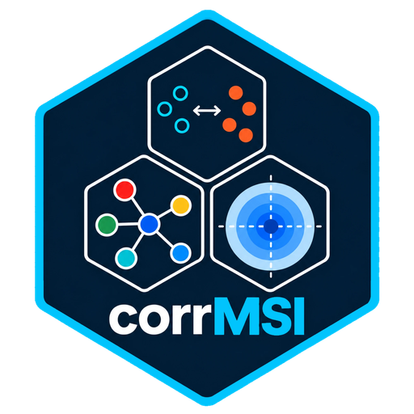

# corrMSI

Tools for analyzing multimodal DESI-MRM mass spectrometry imaging data integrated with other spatial modalities including histochemistry, spatial transcriptomics, and spatial proteomics (from `.zarr` SpatialData objects).

Focus on detecting regional metabolic changes and quantifying spatial correlations across tissue sections — enabling joint analysis of metabolite distributions alongside cellular and molecular spatial context.

---

## Installation

Requires Python 3.10+.

```bash
pip install spatialdata anndata geopandas shapely libpysal esda scikit-learn numpy pandas scipy matplotlib pyyaml statsmodels
```

`statsmodels` is optional — BH-FDR falls back to a built-in implementation if it is absent. All other packages are required.

---

## Quick start

The pipeline is driven end-to-end by a single YAML file. No driver code is needed.

```bash
python run_desi_from_config.py configs/example_exploratory.yaml
```

Two annotated templates are provided in [`configs/`](configs/):

| Config | Use case |
|---|---|
| [`example_exploratory.yaml`](configs/example_exploratory.yaml) | Full sweep — ROI + cell mapping + halos + global & local Moran + Spearman + Pearson + hotspot profiling. Start here for a new study. |
| [`example_focused_lisa.yaml`](configs/example_focused_lisa.yaml) | Hypothesis-driven follow-up — ROI only, local Moran (LISA) only, narrowed to explicit metabolite/ROI pairs. |

Copy a template, set `io.zarr_path` and `io.out_dir`, and adjust the stage toggles.

---

## Input

A SpatialData `.zarr` object containing:

- **DESI tables** — one or more AnnData tables of per-pixel metabolite intensities (auto-detected by regex, e.g. `*_DESI_NORM_obs`)
- **Grid shapes** — per-sample pixel grid polygons (`*_DESI_NORM_grid`, `*_grid`, …); sample identity is recovered by stripping the suffix
- **ROI shapes** *(optional)* — anatomical region polygons (`*_anatomical_labels`, `*_roi`, …)
- **Cell shapes + tables** *(optional)* — cell boundary polygons with associated cell-type and cell-area columns

Detection patterns are all configurable under `detect.*` in the YAML.

---

## Pipeline stages

| Stage | What happens |
|---|---|
| **Detect** | Locate DESI tables, grid shapes, ROI polygons and cell shapes inside the `.zarr` by configurable regex |
| **Pixel table** | Build a `pixels` DataFrame from grid centroids, indexed by composite `"{sample}__{obs_name}"` |
| **ROI annotation** | Coordinate-system-aware `sd.polygon_query` → `ROI_annotation` + `ROI__<label>` binary columns |
| **Cell mapping** | Transform cell shapes into the per-sample coordinate system, then KDTree radius containment (`r = √(area/π) × scalar`) → `CELL__<type>` columns |
| **Distance halos** | Continuous decay columns from ROI edges and cell boundaries — `linear`, `gaussian`, or `binary` |
| **Spatial weights** | libpysal `DistanceBand` or `KNN`, row-standardised, cached in memory and on disk |
| **Global Moran's I** | Univariate + bivariate (`DESI × DESI`, `DESI × CELL__*`, `DESI × ROI__*`) via `esda` |
| **Local Moran (LISA)** | Per-pixel HH / LH / LL / HL quadrant labels, optional per-pixel CSV maps |
| **Correlation** | Spearman ρ and Pearson r across configurable sample sets |
| **Hotspot profiling** | Anchor-based KDTree neighbourhood summaries (optional) |
| **Combine + FDR** | Fisher, Stouffer, DerSimonian–Laird random-effects; BH-FDR q-values on every p-value column |

---

## Key configuration options

```yaml
io:
  zarr_path: "path/to/spatialdata.zarr"
  out_dir:   "path/to/output"

roi:
  roi_group_regex: "(?i)(?:Ctrl_|HDM_)?([Bb]ronch)"   # collapse replicate ROI labels into shared columns
  distance_halo:
    enabled: true
    radius: 12          # coordinate units (1 unit ≈ 1 DESI pixel ≈ 100 µm)
    decay: "gaussian"   # linear | gaussian | binary

cell:
  enabled: true
  coordinate_system: "your_sample_name"
  radius_assignment:
    cell_radius_scalar: 3     # 1.0 = true cell boundary

weights:
  type: "knn"         # knn | distanceband
  knn_k: 32
  cache_dir: "auto"   # auto = <out_dir>/.weights_cache

moran:
  outputs:
    global: { univariate: true, bivariate_desi_roi: true }
    local:
      enabled: true
      bivariate_desi_roi:
        pair_subset:                      # null = all pairs
          - ["metabolite_name", "ROI__bronch"]
```

Halo radii are validated against the measured pixel spacing — the pipeline raises early with an actionable message if a radius resolves to an implausible physical distance.

---

## Outputs

Written to `io.out_dir`:

```
pixels_with_annotation_combined.csv     # pixel table, wide format
pixels_with_annotation_long.csv         # pixel table, full column set
cell_meta.csv                           # cell centroids, area, effective radius
pixel_to_cell_map.csv                   # pixel ↔ cell assignments
moran_univariate_{per_sample,combined}.csv
moran_bivariate_desi_vs_{desi,cell,roi}_{per_sample,combined}.csv
local_moran_univariate_summary.csv
local_bv/met_{met,cell,roi}/             # per-pixel LISA maps
spearman_desi_vs_{desi,cell,roi}.csv
pearson_desi_vs_{desi,cell,roi}.csv
hotspot_neighbourhood/<anchor>.csv
qc/qc_roi__<sample>.png                 # ROI overlay QC
qc/qc_cells__<sample>.png               # cell overlay QC
run_metadata.csv                        # run provenance
```

Every p-value column is accompanied by a BH-FDR `q_`-prefixed counterpart.

---

## Main components

- **`desi_spatial_helpers.py`** — pure function library with no side effects. ROI annotation, KDTree pixel-to-cell mapping, spatial weights construction with caching, global and local Moran's I, cross-sample effect combination, Spearman/Pearson correlations, BH-FDR, and QC plotting. Importable independently for interactive use in notebooks.
- **`run_desi_from_config.py`** — pipeline orchestrator. Reads the YAML, calls helpers in sequence, writes CSV outputs. Nested config keys are resolved with a dotted-path helper so every stage has a sensible default.
- **`configs/`** — annotated example configurations.

---

## Using the helpers directly

For interactive exploration, the helper functions can be imported and composed without the orchestrator:

```python
from desi_spatial_helpers import (
    annotate_pixels_with_roi_strtree,
    build_weights,
    moran_bivariate_per_sample,
    combine_moran_effects,
)
```

---

## License

See [LICENSE](LICENSE).
